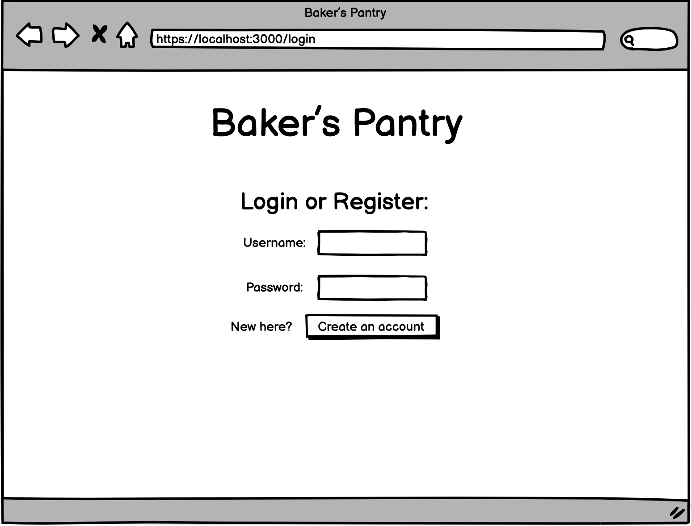
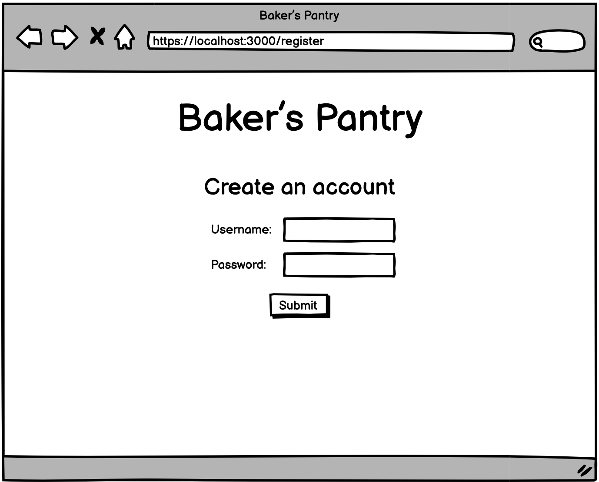
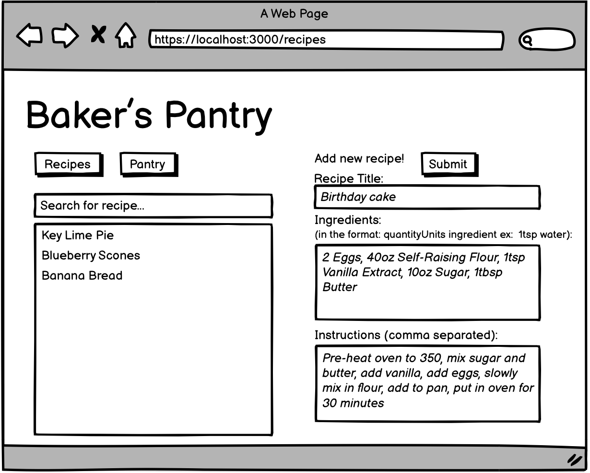
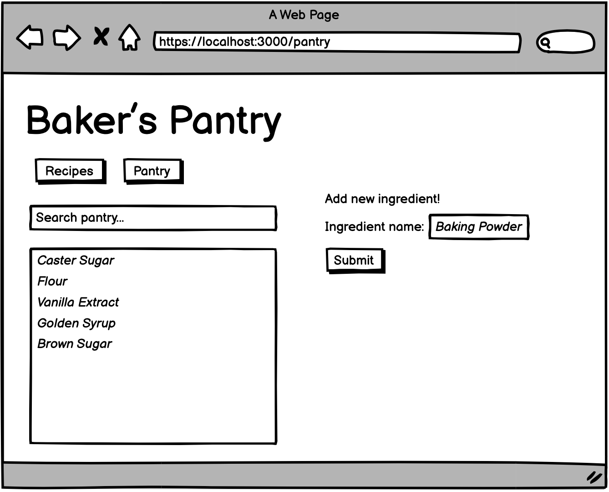

# Baker's Pantry

## Overview

In high school I started a small self-run baking company.  As I was baking so often that  it was hard to keep track of the different recipes I had tried and the ingredients I did or did not have in my pantry. I would try and write it down in my notes or on paper, but it got so confusing and mixed up.


Thus, for this project my website idea is called Baker's Pantry. Baker's Pantry is an easy way for a baker to keep track of the recipes they know and love, as well as what ingredients they have in their pantry. Once a user registers or logs in, they can add to/search through the list of recipes they love and add to/search through the list of ingredients they currently have in their actual pantry. The user can click on each recipe and see a simple display of all the ingredients and steps needed to serve up the delicious dessert. One of the most tedious tasks when baking is having to look through a recipe and going back and forth from the recipe to your pantry to make sure you have all the ingredients you need. This website makes that very easy for a baker with the “Check ingredients” button on each recipe page which compares the ingredients needed for the recipe and the ingredients currently on your pantry list, and immediately lets you know what you need to buy in order to bake this good. 


## Data Model

The application will store Users, Recipes, and Ingredients. 
* Users can have multiple Recipes (via references)
* Each Recipe can have multiple Ingredients (by embedding)

An Example User:

```javascript
{
    username: // username
    password: // hashed 
    recipes: [recipeID]
}

```

An Example Recipe with Embedded Ingredients objects (and array of instructions):

```javascript
Recipe 
{
    name: Birthday Cake
    ingredients: [{name: 'flour',  quantity: 10oz}, . . . ]
    instructions: [array of strings] 
}

```

## [Link to Commented First Draft Schema](db.js) 


## Wireframes


/login - page for the user to log in 



/register - page for the user to register (root / redirects to this page)



/recipes - page for showing all recipes for the user 



/recipes?name=recipeName - user queries for specifc recipe using form


/recipes/recipeName - page to display all info related to recipe 


/pantry - page for user to see all ingredients they have and can add to this list 



/pantry?name=ingredientName - page that loads when a user queries for a specific ingredient 


checkPantry/name - page that loads when a user clicks the "check pantry" button on a recipe page. 


## Site map

Here's a [draft of my site map](documentation/site-map.png)

## User Stories or Use Cases

1. as non-registered user, I can register a new account with the Baker's Pantry site
2. as a user, I can log in to the site
3. as a user, I can create a new recipe and add it to my list of recipes 
4. as a user, I can view all of the recipes I have in one single list 
5. as a user, I can search through the recipes I have in my recipe list 
5. as a user, I can view all the ingredients I have on my "pantry" list. 
6. as a user, I can add a new ingredient to my pantry list 
7. as a user, I search through my pantry list 
8. as a user, I can check if I have the correct ingredients for a recipe with the "check pantry" functionality 


## Research Topics

(___TODO__: the research topics that you're planning on working on along with their point values... and the total points of research topics listed_)

* (5 points) Integrate user authentication
    * I'm going to be using passport for user authentication
    * And account has been made for testing; I'll email you the password
    * see <code>cs.nyu.edu/~jversoza/ait-final/register</code> for register page
    * see <code>cs.nyu.edu/~jversoza/ait-final/login</code> for login page
* (4 points) Perform client side form validation using a JavaScript library
    * see <code>cs.nyu.edu/~jversoza/ait-final/my-form</code>
    * if you put in a number that's greater than 5, an error message will appear in the dom
* (5 points) vue.js
    * used vue.js as the frontend framework; it's a challenging library to learn, so I've assigned it 5 points

10 points total out of 8 required points (___TODO__: addtional points will __not__ count for extra credit_)


## [Link to Initial Main Project File](app.js) 

(___TODO__: create a skeleton Express application with a package.json, app.js, views folder, etc. ... and link to your initial app.js_)

## Annotations / References Used

(___TODO__: list any tutorials/references/etc. that you've based your code off of_)

1. [passport.js authentication docs](http://passportjs.org/docs) - (add link to source code that was based on this)
2. [tutorial on vue.js](https://vuejs.org/v2/guide/) - (add link to source code that was based on this)
